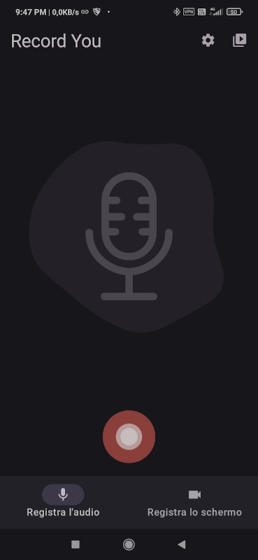
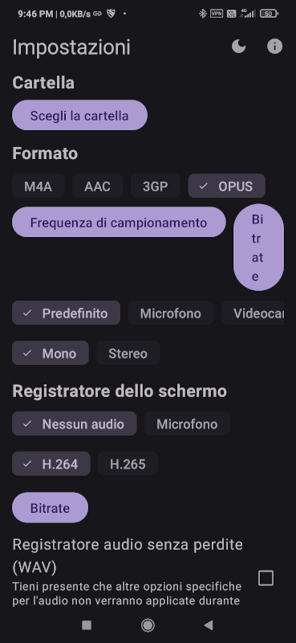
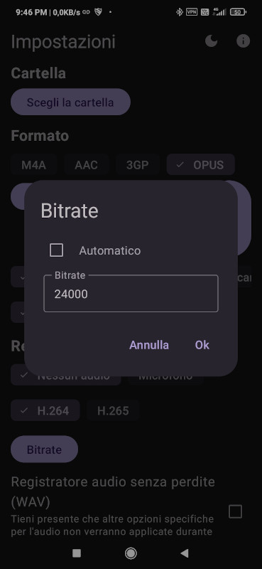
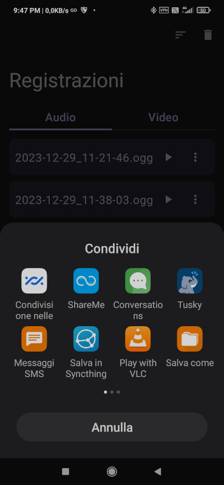

# Guida: come ottimizzare i messaggi vocali in conversation per android

La guida nasce per il seguente motivo: [conversation][1] utilizza un sistema di registrazione dell'audio non ottimizzato (rispetto a WhatsApp o telegram "opus con bitrate medi di circa 28 Kbps") con bit-rate piuttosto alti da 96 a 128 Kbps (AAC) ciò comporta alla produzione di allegati audio di circa 1MB per minuto, questo comporta ad un enorme spreco di banda sopratutto nelle connessioni a consumo dei telefoni cellulari, e di spazio di archiviazione.

Per chi utilizza server [xmpp][2] pubblici e gratuiti, noti per avere dei limiti di archiviazione dati (allegati multimediali) mensili del ordine di 50/150 MB  totali, avere allegati audio così pesanti limita la quantità di messaggi vocali (o multimediali in generale: audio, video, foto) inviabili.

La questione è nota da tempo ma le svariate richieste di ottimizzazione audio allo sviluppatore .. sono praticamente cadute nel vuoto.. per alcuni astrusi problemi tecnici, da non essere vantaggioso metter mano al codice... Cosa ovviamente ottimizzata per video e immagini già da tempo...(audio-chiamate e video-chiamate comprese).

Comunque tralasciando la spinosa questione vi illustrerò il metodo manuale   da me ideato per inviare audio ottimizzato OPUS o ACC con bit-rate contenuti e audio qualitativamente buono.

## requisiti software:

[conversation][3]

[Record You][4]

**Record You** è un potente e altamente configurabile registratore audio, in oltre può registrare anche lo schermo del telefono, per i nostri scopi verrà utilizzato il solo registratore audio, molto più avanzato del semplice registratore di sistema incorporato in conversation.

## configurazione una-tantum di Record You

con la premessa che conversation sia configurato e funzionante, vediamo come configurare **Record You**:

la schermata principale del programma, da ora in poi rinominata home si presenta come in figura sotto. Il simbolo dell'ingranaggio sono le impostazioni, quello del play in alto a destra "la playlist dei file registrati"

andiamo in impostazioni (ingranaggio) e avremo qualcosa come in figura, configuriamo come mostrato in figura, con la spunta su opus (se l'encoder è supportato dal telefono sarà presente il pulsante come in figura). Impostiamo l'audio su mono.

fatto questo impostiamo i valori di bitrate con il pulsante di in alto a destra della sezione audio, togliamo la spunta da automatico è impostiamo il valore 24000 e diamo ok. Avremo così un bit-rate medio di 24Kbps, molto simile alle impostazioni audio di WhatsApp.

configurato il bit-rate, passiamo a configurare la **frequenza di campionamento**, non entrando in tecnicismi su come funzioni opus e sull'encoder di android sia esso software o hardware (integrato nel soc della cpu o gpu), per evitare il resampling e velocizzare la fase di encoding, togliamo la spunta da automatico e impostiamo come in figura sotto, una frequenza di campionamento (fs) di **48000** (48Khz) diamo ok.

possiamo tornare nella schermata home, la configurazione è finita

## utilizzo:

Nel caso dovessimo mandare un messaggio vocale ad un contatto, invece di usare il registratore integrato in conversation, usiamo direttamente **Record You**, apriamo l'applicazione e premiamo rec per registrare, una volta finito il messaggio fermiamo la registrazione.. la troveremo poi nel panello play-list (icona play in alto a destra della home)

la registrazione sarà elencata per data e ora, con la recente, sempre come ultima in basso nella lista non ci resta che toccare i puntini e indicare di condividere la registrazione con conversation, come mostrato in figura, allegheremo cercando nei contatti a chi vogliamo spedire e il gioco è fatto!

[1]: https://conversations.im/
[2]: https://en.wikipedia.org/wiki/XMPP
[3]: https://f-droid.org/packages/eu.siacs.conversations/
[4]: https://f-droid.org/it/packages/com.bnyro.recorder/

