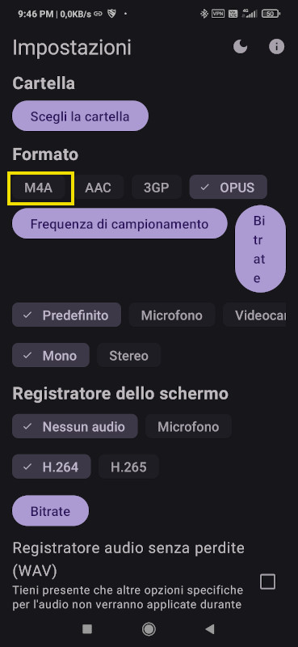
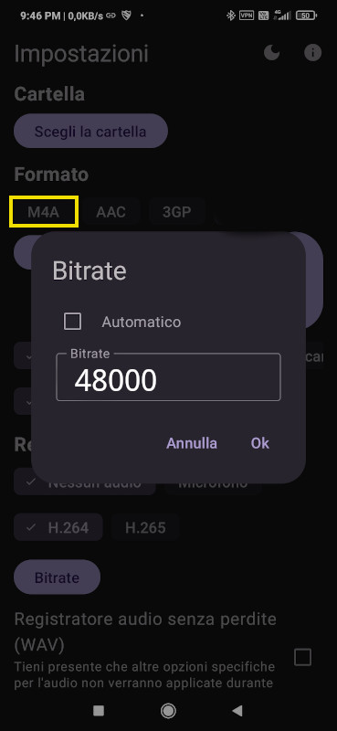
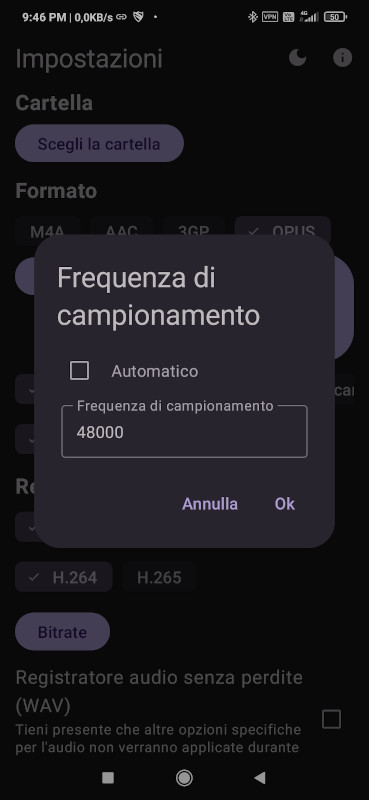
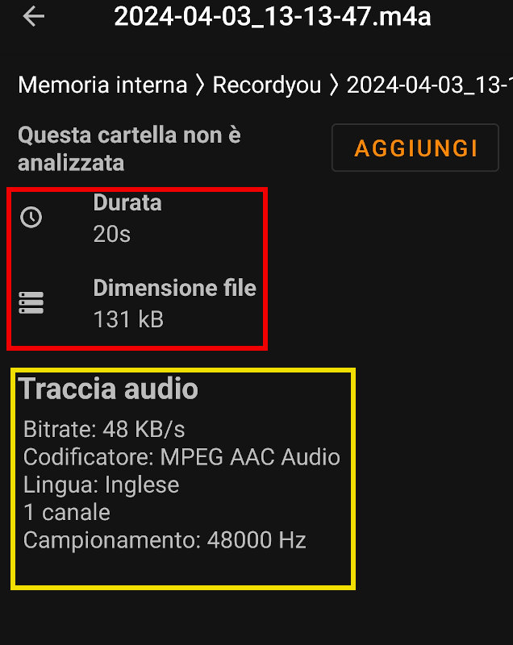
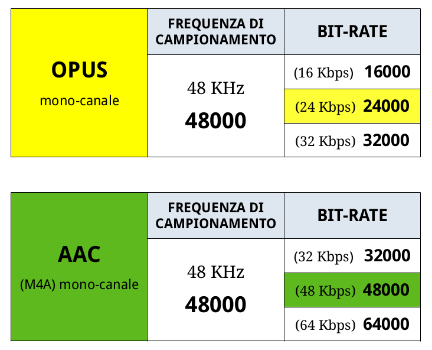

# Guida: come ottimizzare i messaggi vocali in conversation per android (Parte 2)

Come accennato nella parte prima della guida, non tutti i dispositivi android riescono  ad interfacciare la codifica OPUS (encoder di sistema) con l'applicativo RecordYou, tralasciando i tecnicismi del problema,  andreamo ad utilizzare la codifica **AAC** incapsulata in un contenitore **M4A** .

Il motivo per l'utilizzo di M4A e non di un file AAC grezzo, risiede nel fatto che, "AAC file grezzo" non è riconosciuto dal lettore multimediale audio integrato in conversation (in sostanza lo legge come un file allegato generico, e non carica il player), che supporta solo come contenitori audio (ogg,oga,m4a).

## configurazione una-tantum di Record You Per l'utilizzo di M4A (AAC)

*Con la premesssa che abbiate letto la prima parte della guida, e ricordiate la nomenclatura da me utilizzata, salteremo le spiegazioni dell'interfaccia e l'usi con conversation, e andremo direttamente al "settaggio" dell'encoder del formato file*.

Configuriamo come mostrato in figura sotto, con la spunta su **M4A**. Impostiamo l'audio su mono.

Fatto questo impostiamo i valori di bit-rate con il pulsante di "in alto a destra" della sezione audio, togliamo la spunta da automatico, e impostiamo il valore **48000** e diamo ok. Avremo così un bit-rate medio di **48Kbps**. Vedi immagine qui sotto.

Configurato il bit-rate, passiamo a configurare la **frequenza di campionamento**, togliamo la spunta da automatico e impostiamo come in figura sotto, una frequenza di campionamento (fs) di **48000** (48Khz) diamo ok.

possiamo tornare nella schermata home, la configurazione  **M4A** è finita!

### file di prova M4A di 20 secondi

## Impostazioni per audio parlato, da me testate e consigliate per RecordYou

Per entrambi i formati audio, come si vede in tabella avete una scelta tra: BASSO, MEDIO, ALTO bit-rate, chi è più smaliziato può fare delle prove su questi parametri da me selezionati (tipo se ha esigenze di risparmiare ancora più spazio, o vuole aumentare la qualità dell'audio) rispetto alle impostazioni "medie" che ho suggerito nella guida.

buona continuazione!

