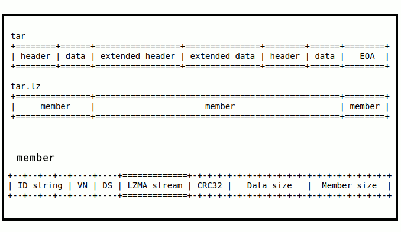

# lzip, questo sconosciuto compressore dati.

**Lzip** è un programma di compressione dati senza perdita, basato sull' algoritmo **LZMA** (l'algoritmo di 7zip), Implementa un controllo di integrità file molto sicuro e un'interfaccia utente e comandi simile a quella di gzip o bzip2 in ambito unix/linux. Nelle distribuzioni Linux più diffuse, lzip può essere installato con semplicità, dai repository dei pacchetti ufficiali.

La suite di programmi lzip è stata scritta in C++ e C da **Antonio Diaz Diaz** e viene distribuita come software libero secondo i termini della versione 2 o successiva della GNU General Public License (GPL).

**Lzip** decomprime velocemente quasi come gzip e comprime meglio di bzip2, il che lo rende adatto per la distribuzione di software e l'archiviazione dei dati a lungo termine. 

Il formato di file lzip (.lz) è una versione migliorata del deprecato e non sicuro formato di file "lzma-alone" (.lzma) della suite lzma-sdk.


Lzip implementa una versione semplificata dell'algoritmo LZMA (algoritmo di Lempel-Ziv-Markov). Questa elevata compressione di LZMA deriva dalla combinazione di due basilari e ben testate idee sulla compressione dati: dizionari scorrevoli (LZ77) e modelli di Markov (l'idea usata da ogni algoritmo di compressione che utilizza la codifica a intervalli o un codificatore ad entropia di orderine 0 nel suo ultimo stadio), con separazione dei contesti in base a ciò per cui i bit vengono utilizzati.

Per massimizzare l'interoperabilità con **sistemi a 32 bit**, la dimensione massima del dizionario utilizzabile è **512 MiB** in modo che qualsiasi file creato con lzip possa essere decompresso senza problemi su macchine a 32 bit. Lzip fornisce un controllo accurato e robusto dell'integrità a 3 fattori. Lzip può comprimere alla stessa velocità di gzip (lzip -0) o comprimere la maggior parte dei file più di bzip2 (lzip -9). La velocità di decompressione è intermedia tra gzip e bzip2. Lzip è migliore di gzip e bzip2 dal punto di vista del recupero dati. Lzip è stato progettato, scritto e testato con grande cura per sostituire gzip e bzip2 come formato di compressione standard ad uso generale.

Le idee incarnate in lzip sono dovute  (quantomeno) alle seguenti persone: Abraham Lempel e Ziv Jacob (per l'algoritmo LZ), Andrey Markov (per la definizione delle catene di Markov), G.N.N. Martin (per la definizione della codifica a intervalli), Igor Pavlov (per aver messo insieme tutto questo in LZMA e in 7zip), Julian Seward (per la CLI di bzip2),  ad  Antonio Diaz Diaz  per aver rielaborato il tutto e creato di fatto  Lzip.

# Compressione Parallela

lzip ha due interfacce per la compressione parallela 

- **plzip** comprime qualsiasi file in modo parallelo e multi processore. Usarlo con tar non è indicato, poiché il programma tar convenzionale ha bisogno dell'intero flusso dati, prima di poter individuare un determinato file per la decompressione, con conseguente estrazione non parallela.

- **tarlz** combina tar e lzip in un archiviatore parallelo molto simile agli archiviatori moderni come RAR o 7-Zip. I blocchi di compressione solidi si allineano con i limiti e gli indici del file tar, quindi l'estrazione di un file richiede solo la decompressione di quel particolare membro o blocco.


# Lziprecover

Lziprecover è uno strumento di recupero dati danneggiati e decompressore per i file nel formato lzip. 

# Storia

**7-Zip** è stato rilasciato nel 2000; uno strumento che utilizza LZMA è diventato disponibile per la prima volta su sistemi operativi simili a Unix nel 2004, quando è stato rilasciato un port della versione da riga di comando di 7-Zip (p7zip). 

Nel 2004 divenne disponibile **LZMA SDK**, che includeva il programma chiamato “**lzma_alone**”, meno di un anno dopo, **Lasse Collin pubblicò LZMA Utils**, che inizialmente consisteva solo in una serie di script wrapper che implementavano un'interfaccia simile a gzip per lzma_alone. 

**Nel 2008, Antonio Diaz Diaz** ha rilasciato lzip, che utilizza un formato contenitore con checksum e magicnumber, invece del flusso di dati grezzi LZMA, fornendo una soluzione completa in stile Unix per l'utilizzo di LZMA. 

Tuttavia, LZMA-Utils di Lasse Collin è stato esteso nel tempo, Lasse Collin fondò "The Tukaani Project" in seguito grazie al supporto economico del progetto GNU, nacque XZ-Utils,  uno strumento con funzionalità simili a quelle di lzip.

XZ-Utils, a differenza di lzip si basa su **LZMA2** e sul formato contenitore XZ. Questo formato divenne parte del progetto GNU e adottato in maniera pesante come metodo di compressione per la distribuzione del codice sorgente.

L'adozione di XZ-Utils e del formato XZ da parte del progetto GNU, resero meno popolare lzip, rendendo di fatto XZ, XZ-Utils il "vincitore" del formato lzma2 su linux.

Alla fine lzip, seppur un progetto senza fondi economici e con bassa popolarità, con un solo sviluppatore (Antonio Diaz Diaz), continua fino ad oggi 2024 a crescere e svilupparsi mantenendo una resilienza davvero encomiabile, tanto da ritagliarsi nel tempo, un piccolo gruppo di estimatori delle sue qualità; per la  robustezza, e semplicità del codice sorgente, è utilizzato per scopi didattici in alcune università, le specifiche del contenitore e del formato sono pubblicamente disponibili e certificate da Internet Engineering Task Force (IETF), un pregio che XZ-Utils non è riuscito a conquistarsi, visto l'approccio "macchinoso" e confusionario pesante nel suo codice sorgente.

Per sbeffeggiare la mancata considerazione del progetto GNU nei riguardi di  lzip, l'autore considera scherzosamente lzip come non-GNU, al punto di acquistarne un dominio, dove è ospitato il progetto.

https://lzip.nongnu.org/


# Supporto

- GNU Autotools supporta lzip. L'aggiunta di dist-lzip a AM_INIT_AUTOMAKE creerà tarball lzip.
- Le versioni 1.23 e successive di **GNU TAR**  utilizzano lzip per gestire i file compressi in modo trasparente.
- Lo strumento di archiviazione di GNOME, Archive Manager, supporta i file lzip.
- libarchiver e bsd-tar supportano il formato lzip.

# Applicazioni

- La distribuzione Linux Dragora GNU/Linux-Libre utilizza lzip per i suoi pacchetti software.
- Lzip viene utilizzato per distribuire il database del fuso orario di IANA.
- Il Parlamento Europeo pubblica i dump completi del suo database in formato JSON compresso con lzip.
- Lzip è utilizzato nel Planetary Data System (PDS) della NASA.

---

# LZIP GUIDA RAPIDA PARTE 1

lzip viene invocato in questo modo:

```
zip [options] [files]
```

Se non viene specificato alcun nome di file, lzip comprime (o decomprime) da dall'input standard all'output standard. Un trattino ' - ' utilizzato come file argomento significa input standard. Può essere mescolato con altri file ed è letto solo una volta, la prima volta che appare nella riga di comando. Ricordati di anteporre ./ a qualsiasi nome di file che inizia con un trattino oppure utilizzare ' - - '. 


## Opzioni più usate:

NB: questa è una lista parziale, per avere la lista estesa di tutte le opzioni disponibile fare riferimento all'help del programma o al manuale.

| opzione  | significato |
|----------|-------------|
|   **-h**   (\--help)   | Stampa a video l'aiuto (help) del programma, descrive l'utilizzo delle opzioni del programma stesso. |
|  **-V**   (\--version)   | Stampa il numero di versione di lzip sullo standard output (video).|
|  **-d**    (\--decompress)  | Decomprime i file specificati, e ne controlla l'integrità.  | 
|  **-f**   (\--force)  | Forza la sovrascrittura dei file di output. |
| **-k**   (\--keep)  | Conserva (non elimina) i file di input durante la compressione o decompressione. |
| **-l**  (\--list)  | Stampa la dimensione non compressa, la dimensione compressa e la percentuale salvata del file file specificati. Se viene fornito più di un file, una riga finale contenente le dimensioni cumulative viene stampata. Con "-v" , il dizionario, il numero di membri e la quantità dei dati finali vengono visualizzati. Con "-vv", aumentano le informazioni stampate.|
| **-m byte** (\--match-length=byte) | Durante la compressione, imposta la  lunghezza limite della stringa di corrispondenza in byte da ricercare. I valori validi vanno da "5" a "273". Valori più grandi solitamente danno rapporti di compressione migliori ma una compressione più lunga volte. |
| **-o file** (\--output=file) | Se "-c" non è stato specificato, scrive l'output (de)compresso nel file di uscita, creando automaticamente eventuali directory principali mancanti; Mantiene i file di input invariati. Se si comprimono più file, ogni file viene compresso indipendentemente. "-o-" è equivalente al parametro "-c". Quando si comprime e si divide l'output in volumi, il file viene utilizzato come un prefisso e diversi file denominati "file 00001.lz", "file 00002.lz", ecc., vengono creati. In questo caso, un solo file input è consentito. |
| **-q** (\--quiet) |  Funzionamento silenzioso. Elimina tutti i messaggi. |
| **-S byte** (\--volume-size=bytes)  | Durante la compressione, con  "-c" non  specificato, divide l' output compresso in diversi file di volume con nome tipo:  "nome_originale00001.lz", "nome_originale00002.lz", ecc... e imposta il file limite della dimensione del volume in byte . I file di input vengono mantenuti invariati. Ogni volume è un file lzip completo, forse multi-membro. Una piccola dimensione del volume può degradare il rapporto di compressione, quindi usalo solo quando necessario.
| **-s byte**  (\--dictionary-size=bytes)  | Durante la compressione, imposta il limite della dimensione massima del dizionario in byte. Lzip utilizza per ciascun file in input, la dimensione massima del dizionario impostato, solo se  questo valore non supera  la dimensione del file di input. In parole semplici il valore del dizionario utilizzato sarà sempre inferiore alla grandezza del file da comprimere. lzip utilizzerà in automatico un valore di dizionario più basso, rispetto al valore massimo impostato nel caso in cui tale valore impostato risulti in conflitto con la dimensione del file di input. I valori validi vanno da 4 KB a 512 MB. I valori da 12 a 29 vengono interpretati come potenze di due, ovvero da 2^12 a 2^29 byte. Le dimensioni del dizionario sono quantizzate in modo che possano essere codificate in un solo byte (vedi coded-dict-size). Se la dimensione specificata non corrisponde a una delle dimensioni valide, viene arrotondata per eccesso sommandola a (byte / 8). |
|  **-t**  (\--test)  | Controlla l'integrità dei file specificati. "\--test" esegue  una decompressione di prova e cancella il risultato della decompressione. Usalo insieme a "-v" per visualizzare le informazioni sui file.|
|  **-v**  (\--verbose) | Durante la compressione, mostra il rapporto di compressione e la dimensione per ciascun file elaborato. Durante la decompressione o il test, ulteriori -v (fino a 4) aumentano il livello di verbosità, mostrando lo stato, il rapporto di compressione, la dimensione del dizionario, il contenuto del trailer (CRC, dimensione dei dati, dimensione del membro) e fino a 6 byte di dati finali (se presenti) sia in formato esadecimale che come stringa di caratteri ASCII stampabili. Due o più "-v"  mostrano l'avanzamento della (de)compressione. |
| **-0** .. **-9**   | Livello di compressione. Imposta i parametri di compressione (dimensione del dizionario e limite di durata della corrispondenza) come mostrato nella tabella seguente. Nella compressione predefinita il livello è -6 , equivalente a (-s8MiB -m36) . Notare che -9 può essere molto più lento di -0 . Queste opzioni non hanno effetto durante la decompressione, il test o l'elencazione. Lo spazio dei parametri bidimensionali di LZMA non può essere mappato su una scala lineare ottimale per tutti i file. Se i tuoi file sono grandi, molto ripetitivi, ecc., potrebbe essere necessario utilizzare le opzioni dimensione dizionario (-s) e lunghezza stringa di corrispondenza (-m) direttamente per ottenere prestazioni ottimali. Se imposti diversi livelli di compressione, viene utilizzata l'ultima impostazione. Per esempio -9 -s64MiB È equivalente a -s64MiB -m273 |


## Lzip: livello di compressione

Lzip, come accennato nella precedente tabella delle opzioni, utilizza dei livelli di compressione prestabiliti a priori, vediamo nella tabella riportata qua in basso, la specifica di questi pre-set.


|Livello| Dimensione del dizionario (-s) | 	Limite stringa di corrispondenza (-m) |
|:-----:|:---------:|:---------:|
| -0 	|  64 KiB 	|  16 byte  |
| -1 	|  1 MB 	|  5 byte   |
| -2 	|  1,5 MB 	|  6 byte   |
| -3 	|  2 MB 	|  8 byte   |
| -4 	|  3 MB 	|  12 byte  |
| -5 	|  4 MB 	|  20 byte  |
| -6 	|  8 MB 	|  36 byte  |
| -7 	|  16 MB 	|  68 byte  |
| -8 	|  24 MB 	|  132 byte |
| -9 	|  32 MB 	|  273 byte |


(\--fast) e (\--best)

Sono alias di (-0) e (-9),  sono comandi introdotti per avere una sintassi simile a GNU gzip.

---

## Lzip: esempi di utilizzo generico

Archiviare un file, sostituendolo con una versione compressa:

```
lzip path/file
```
 
Archiviare un file, mantenendo il file di input:

```
lzip -k path/file
```

Archiviare un file con la migliore compressione (livello=9) (compressione lenta) :

```
lzip --best path/file
```


Archivia un file alla massima velocità (livello=0):

```
lzip --fast path/file
```

Archivia un file con buona velocità con compressione di livello 4 (dizionario da 3MB):

```
lzip -4 path/file
```

Archivia un file (più lento) con maggiore compressione,  livello 7 (dizionario da 16MB):

```
lzip -7 path/file
```
 
Testare l'integrità del file compresso:

```
lzip --test path/archive.lz
```


Decomprimere un file, sostituendolo con la versione originale non compressa: 

```
lzip -d path/archive.lz
```


Decomprimere un file, mantenendo l'archivio:

```
lzip -d -k path/archive.lz
```

Elenca i file che si trovano in un archivio e mostra le statistiche di compressione:

```
lzip --list path/archive.lz
```

---


**NB:** *il "path" è il percorso (albero delle cartelle dove è contenuto il file), se il nostro terminale è nello stesso "path" dei file da processare, possiamo omettere il "path" dei file da processare quando invochiamo lzip.*

Facciamo un esempio pratico: 

Supponiamo che nel computer ho la cartella "documenti" contenente vari file di testo,  dentro questa cartella voglio comprimere il file "esempio.txt". Ho due strade:

1)  apro un terminale in quella cartella (in quel percorso) in questo caso il comando sarà:

```
lzip -k esempio.txt
```

2)  ho un terminale in un "path" diverso da "documenti" quindi devo indicare a lzip dove si trovi il file, ad esempio:


```
lzip -k home/documenti/esempio.txt
```

questo è in sostanza il riferimento che ho utilizzato negli esempi qui sopra.

 
 
---

## Come comprimere directory

Come accennato precedentemente **lzip** opera unicamente su un singolo file per volta, quindi in parole spicce è impossibilitato a comprimere intere directory di file in un unico file compresso, per fare ciò si usa prima archiviare con **tar** la directory/cartella da comprimere, per poi comprimerla in un secondo momento con lzip.

```
lzip archivio.tar
```


avremo un file chiamato:

```
archivio.tar.lz
```

questo approccio potrebbe risultare scomodo (comandi archivio tar + comandi lizp), perché effettivamente andremo a scrivere una miriade di comandi, fortunatamente è possibile fare questa operazione direttamente con un unico comando tar simile a questo:

```
tar --lzip -cvf nome_archivio cartella_da_comprimere
```


le opzioni del comando **tar** utilizzato in precedenza hanno il seguente significato:

```
--lzip   dice a tar che deve usare lzip per comprimere il file
   c     dice a tar di creare archivio di file non compresso
   v     modalità dettagliata, mostra quali file vengono elaborati
   f     l'output file 
   x     estrae i file dall'archivio
```


vediamo un esempio, supponiamo che ho una cartella chiamata "documenti" contenente file vari, vorrei comprimerla con lzip in un archivio compresso tar.lz chiamato archivio_documenti:

```
tar --lzip -cvf archivio_documenti.tar.lz documenti
```

per estrarlo:

```
tar --lzip -xvf archivio_documenti.tar.lz
```


se il file presenta estensione "**tar.lz**" **tar** è in grado di riconoscerlo come "archivio compresso lzip" e si può omettere il parametro "\--lzip"  **in fase di estrazione**:

```
tar -xvf archivio_documenti.tar.lz
```


con GNU TAR è anche possibile passare parametri opzionali al "compressore", supponiamo ad esempio di voler comprimere e archiviare la solita cartella documenti, questa volta contenente ad esempio solo file di testo semplice (hanno un alto rapporto di compressione) e di voler utilizzare un grado di compressione di lzip di tipo -7  a discapito del tempo, avremo un comando simile a questo:

```
tar -c -I 'lzip -7' -vf archivio_documenti.tar.lz documenti
```

le opzioni del comando **tar** utilizzato in precedenza hanno il seguente significato:


```
-c   dice a tar di creare archivio di file non compresso
-I   indica il programma di compressione e i parametri da usare
-v   modalità dettagliata, mostra quali file vengono elaborati
-f   l'output file 
```


per ulteriori combinazioni di comandi fare riferimento al manuale di GNU TAR.

```
man tar
```

---

# LZIP GUIDA RAPIDA PARTE 2

**Tarlz** è un'implementazione parallela (multi-thread) e multi-membro (multi-blocco) dell'archiviatore tar e del compressore **lzip** . Tarlz usa la libreria di compressione **lzlib** .

Tarlz crea archivi tar utilizzando una variante semplificata e più sicura del formato **POSIX PAX** con compressione in formato lzip, mantenendo l'allineamento tra i membri tar e i membri lzip.

**L'archivio tar.lz multimembro risultante è retrocompatibile con gli strumenti tar standard come GNU tar, che lo trattano come qualsiasi altro archivio tar.lz solido, GNU Tar lo decomprimerà in maniera sequenziale.**
 
Tarlz può aggiungere file alla fine di tali archivi compressi.


## Note di funzionamento di tarlz

Introduciamo due postulati fondamentali:

- **Gli archivi solidi non possono essere creati né decodificati in parallelo.**

- **Per implementare un archiviatore e compressore parallelo (multi-thread) è necessario che esso funzioni tramite blocchi di dati.** 



Tarlz non processa il file in ingresso come "intero" (in maniera sequenziale), ma l'intero file di ingresso, sarà diviso in "N" blocchi o porzioni di dati,  in modo tale che, il processore multi core della macchina, possa processare più blocchi contemporaneamente e parallelamente; ogni core processerà indipendentemente dagli altri, i blocchi a lui assegnati, diminuendo in questo modo il tempo computazionale dell'operazione, rispetto ad un approccio sequenziale e solido.


Nello specifico, tarlz costruisce un  archivio Tar multi-membro e lo allinea in input a lzip, che a sua volta, costruisce un file compresso multi-membro allineato con il Tar di partenza.


---

Mantenere l'allineamento tra i membri tar e i membri lzip ha due vantaggi. Aggiunge un livello lzip indicizzato sopra l'archivio tar, rendendo possibile la decodifica dell'archivio in modo sicuro in parallelo. Inoltre riduce al minimo la quantità di dati persi in caso di danneggiamento. L'accesso ai dati è più veloce. 

Questa accortezza ,  comporta maggior robustezza in caso di corruzione dell'archivio, buona parte dell'archivio può essere recuperata, l'accesso non sequenziale a porzioni specifiche di dati  interessa solo il blocco corrispondente in archivio e la sua eventuale decompressione.


**Tarlz può creare archivi tar con cinque livelli di granularità di compressione:**

- per file (\--no-solid), 
- per blocco (\--bsolid, predefinito), 
- per directory (\--dsolid), 
- solid appendibile (\--asolid) 
- solid (\--solid). 
- Può anche creare archivi tar non compressi.

**Naturalmente, comprimendo ogni file (o ogni directory) individualmente non si può raggiungere un rapporto di compressione elevato quanto quello ottenuto comprimendo in modo uniforme l'intero archivio tar, ma si ottengono i seguenti vantaggi:**

- L'archivio tar.lz multimembro risultante può essere decompresso parallelamente, moltiplicando la velocità di decompressione.

- Nuovi membri possono essere aggiunti all'archivio (rimuovendo il membro di fine archivio) e i membri indesiderati possono essere eliminati dall'archivio. Proprio come un archivio tar non compresso.

- È un formato di backup sicuro in stile POSIX. In caso di corruzione, tarlz può estrarre tutti i membri non danneggiati dall'archivio tar.lz, saltando i membri danneggiati, proprio come il tar standard (non compresso). Inoltre, l'opzione '--keep-damaged' può essere usata per recuperare quanti più dati possibili da ogni membro danneggiato, e lziprecover può essere usata per recuperare alcuni dei membri danneggiati.

---

## Uso di tarlz

*tarlz si invoca in questo modo:*

```
tarlz [options] [files]
```

*le opzioni sono le seguenti:*


| OPTIONS:                   | DESCRIPTION:                                      |
|----------------------------|---------------------------------------------------|
| \--help                    | display this help and exit                        |
| -V, \--version             | output version information and exit               |
| -A, \--concatenate         | append archives to the end of an archive          |
| -B, \--data-size=\<bytes\> | set target size of input data blocks [2x8=16 MiB] |
| -c, \--create              | create a new archive                              |
| -C, \--directory=\<dir\>   | change to directory \<dir\>                       |
| -d, \--diff                | find differences between archive and file system  |
| \--ignore-ids              | ignore differences in owner and group IDs         |
| \--delete                  | delete files/directories from an archive          |
| \--exclude=\<pattern\>     | exclude files matching a shell pattern            |
| -f, \--file=\<archive\>    | use archive file \<archive\>                      |
| -h, \--dereference         | follow symlinks; archive the files they point to  |
| n, \--threads=\<n\>        | set number of (de)compression threads [2]         |
| -q, \--quiet               | suppress all messages                             |
| -r, \--append              | append files to the end of an archive             |
| -t, \--list                | list the contents of an archive                   |
| -v, \--verbose             | verbosely list files processed                    |
| -x, \--extrac              | extract files/directories from an archive         |
| -0 .. -9                   | set compression level [default 6]                 |
| \--uncompressed            | don't compress the archive created                |
| \--asolid                  | create solidly compressed appendable archive      |
| \--bsolid                  | create per block compressed archive (default)     |
| \--dsolid                  | create per directory compressed archive           |
| \--no-solid                | create per file compressed archive                |
| \--solid                   | create solidly compressed archive                 |
| \--anonymous               | equivalent to '--owner=root --group=root'         |
| \--owner=<owner>           | use <owner> name/ID for files added               |
| \--group=<group>           | use <group> name/ID for files added               |
| \--keep-damaged            | don't delete partially extracted files            |
| \--missing-crc             | exit with error status if missing extended CRC    |
| \--out-slots=<n>           | number of 1 MiB output packets buffered [64]      |


Exit  status: 0 for a normal exit, 1 for environmental problems (file not found, invalid flags, I/O errors, etc), 2 to indicate a corrupt or invalid input  file, 3 for an internal consistency error (eg, bug) which caused tarlz to panic.


---

## Alcuni esempi di tarlz

**Esempio 1:** crea un archivio compresso multiplo: 

Archive.tar.lz contenente file A ,B ,C.

```
tarlz -cf archive.tar.lz a b c
```
 

**Esempio 2:** Incorpora il file "d" e il file "e" alla fine dell'archivio multi-membro "Archive.tar.lz" .

```
tarlz -rf archive.tar.lz d e
```


**Esempio 3:** creare un archivio (solid appendibile) Archive.tar.lz contenente i file a,b,C . Quindi aggiungi i file "d" ed "e"  alla fine dell'archivio.


```
tarlz --asolid -cf archive.tar.lz a b c
tarlz --asolid -rf archive.tar.lz d e
```


**Esempio 4:** creare un archivio (solid appendibile) contenente le directory "dir1", "dir2", "dir3" con un membro lzip separato per directory. Quindi aggiungi i file a,b,c,d,e all'archivio, tutti contenuti in un unico membro lzip. L'archivio risultante Archive.tar.lz contiene 5 membri LZIP (incluso il membro di fine archivio).


```
tarlz --dsolid -cf archive.tar.lz dir1 dir2 dir3
tarlz --asolid -rf archive.tar.lz a b c d e
```


**Esempio 5:** creare un archivio solido "archive.tar.lz" contenente i file a,b,c. Nota bene,  non si possono aggiungere altri file successivamente  all'archivio.

``` 
tarlz --solid -cf archive.tar.lz a b c
```
 

**Esempio 6:** estrai tutti i file dall'archivio Archive.tar.lz .

``` 
tarlz -xf archive.tar.lz 
```
 

**Esempio 7:** estrazione dei file "a" e "c" con l'intero albero delle sotto directory "dir1" dall'archivio "Archive.tar.lz" .

```
tarlz -xf archive.tar.lz a c dir1
```

**Esempio 8:** copia il contenuto della directory "sourcedir" alla directory "destdir" .

```
tarlz -C sourcedir --uncompressed -cf - . | tarlz -C destdir -xf -
```

**Esempio 9:** comprimere l'archivio Posix esistente "Archive.tar" e scrivi l'output in "Archive.tar.lz . Comprimere ogni membro individualmente per Disponibilità massima. (Se un membro nell'archivio compresso viene danneggiato, gli altri membri possono ancora essere estratti).

```
tarlz -z --no-solid archive.tar
```


**Esempio 10:** comprimere l'archivio "Archive.tar" e scrivi l'output come "foo.tar.lz".

```
tarlz -z -o foo.tar.lz archive.tar
```

**Esempio 11:** concatenare e comprimere due archivi "archive1.tar" e "archive2.tar" e scrivere l'output come "foo.tar.lz" .

```
tarlz -A archive1.tar archive2.tar | tarlz -z -o foo.tar.lz
```

---


# riferimenti e bibliografia

https://lzip.nongnu.org/

https://lzip.nongnu.org/manual/lzip_manual.html

https://lzip.nongnu.org/lzip_benchmark.html

https://lzip.nongnu.org/xz_inadequate.html

https://lzip.nongnu.org/tarlz.html

https://lzip.nongnu.org/lzlib.html

https://lzip.nongnu.org/lziprecover.html

https://www.nongnu.org/zutils/zutils.html

https://en.wikipedia.org/wiki/Lzip

https://www.gnu.org/software/automake/manual/html_node/List-of-Automake-options.html

https://datatracker.ietf.org/doc/html/draft-diaz-lzip

https://www.nongnu.org/lzip/manual/lzip_manual.html#File-format

http://download.savannah.gnu.org/releases/lzip/

http://lists.gnu.org/mailman/listinfo/lzip-bug

---


